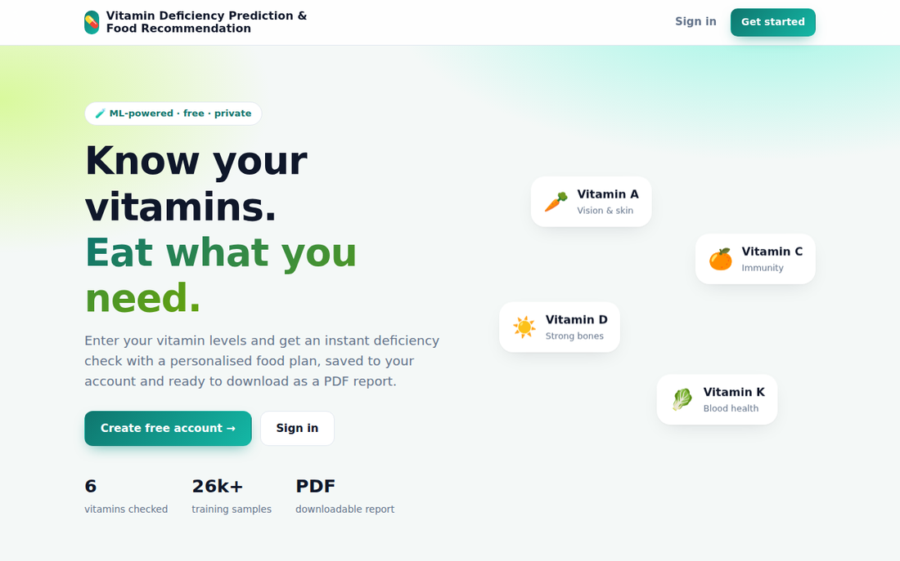
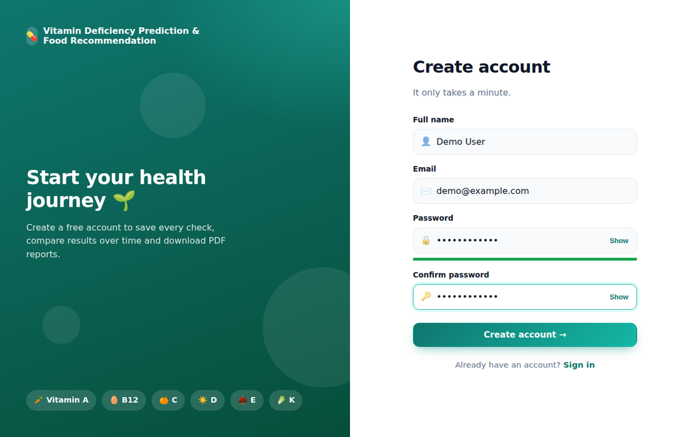
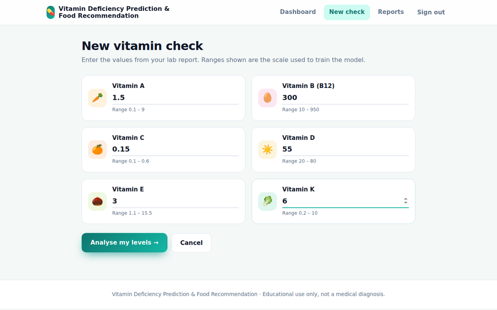
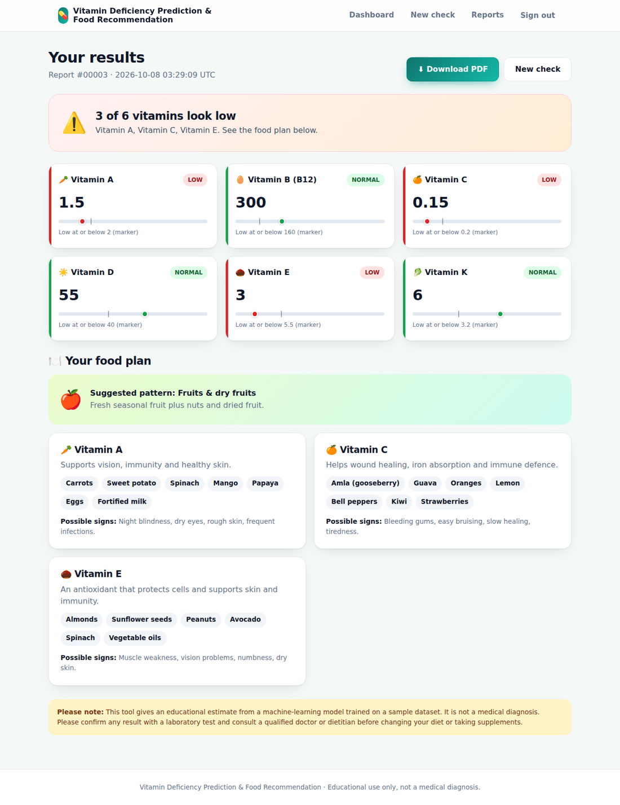
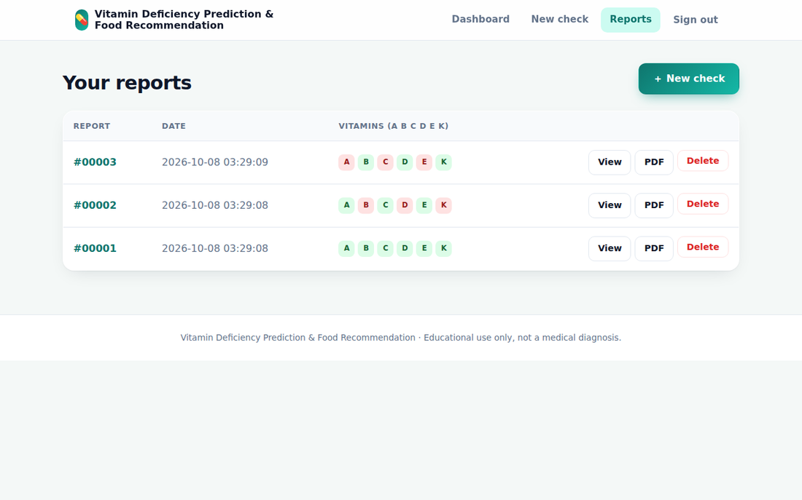
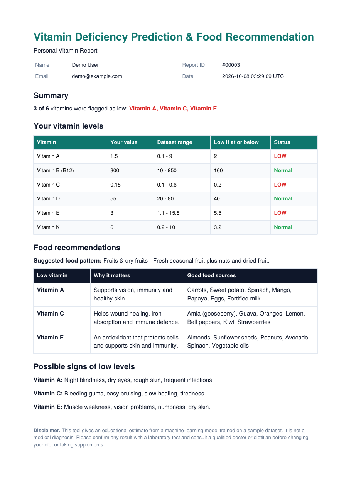
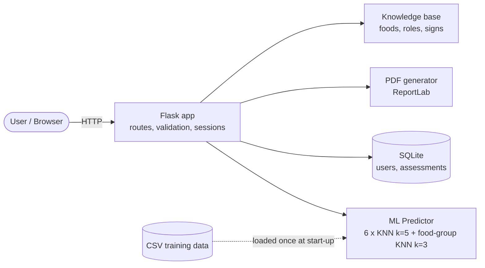
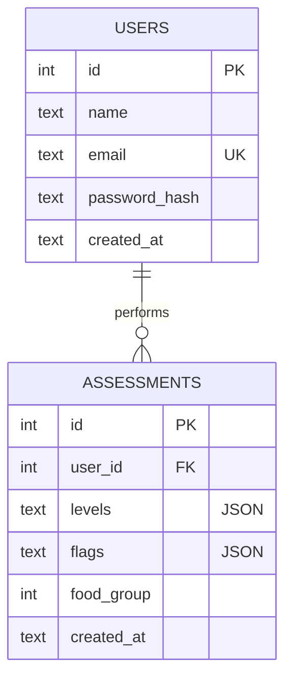
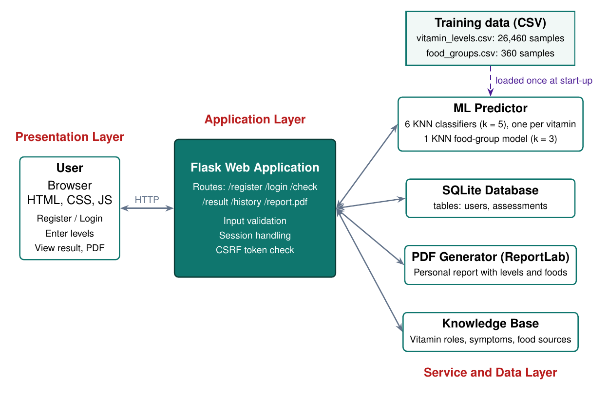

<div align="center">

# 💊 Vitamin Deficiency Prediction & Food Recommendation

**Enter six vitamin levels → get an instant low/normal result, a personalised food plan and a downloadable PDF report.**




</div>

---

## 📑 Table of contents

- [Features](#-features)
- [Screenshots](#-screenshots)
- [Tech stack](#-tech-stack)
- [Quick start](#-quick-start)
- [How it works](#-how-it-works)
- [Project structure](#-project-structure)
- [Routes](#-routes)
- [Configuration](#-configuration)
- [Model and data notes](#-model-and-data-notes)
- [Disclaimer](#-disclaimer)
- [Roadmap](#-roadmap)
- [License](#-license)

## ✨ Features

| | |
|---|---|
| 🧠 **Instant prediction** | One KNN classifier per vitamin (A, B, C, D, E, K) labels each level as *low* or *normal*. |
| 🍽️ **Food recommendations** | A food-group pattern for the combination of low vitamins, plus specific foods, the role of the vitamin and possible signs of deficiency. |
| 🔐 **Accounts** | Register / log in with hashed passwords, CSRF-protected forms and per-user access control. |
| 🗂️ **History** | Every check is saved in SQLite; reopen or delete past reports. |
| 📄 **PDF report** | One-click, print-ready report for any saved check ([sample](docs/sample-report.pdf)). |
| 📱 **Responsive UI** | Clean custom interface that works on desktop and mobile, no front-end build step. |
| ⚡ **Fast and light** | Models are trained once at start-up; no database server needed. |

## 🖼️ Screenshots

<table>
  <tr>
    <td align="center"><b>Register</b><br></td>
    <td align="center"><b>Enter levels</b><br></td>
  </tr>
  <tr>
    <td align="center"><b>Result and food plan</b><br></td>
    <td align="center"><b>Report history</b><br></td>
  </tr>
</table>

<p align="center">
  <b>Downloadable PDF report</b><br>
  
</p>

> Screenshots show a demo account with sample values, not real patient data.

## 🧰 Tech stack

| Layer | Technology |
|---|---|
| Language | Python 3.9+ |
| Web | Flask, Jinja2 templates, HTML / CSS / vanilla JavaScript |
| Machine learning | scikit-learn (KNN), pandas |
| Database | SQLite3 (built in, zero setup) |
| PDF | ReportLab |
| Security | Werkzeug password hashing, CSRF tokens, parameterised SQL |

## 🚀 Quick start

```bash
# 1. get the code
git clone <your-repo-url>
cd vitamin-deficiency-prediction

# 2. create a virtual environment
python -m venv .venv
source .venv/bin/activate        # Windows: .venv\Scripts\activate

# 3. install dependencies
pip install -r requirements.txt

# 4. run
python app.py
```

Open **http://127.0.0.1:5000**, create an account and run your first check.

The SQLite database (`instance/vitamin.db`) and a secret key are created automatically on first run.

> **Tip:** keep `.venv` out of any zip or upload. It is large (hundreds of MB) and is already in `.gitignore`.

## 🔬 How it works



1. The user enters the six levels; the server validates them.
2. Each vitamin's KNN classifier returns **low** or **normal**.
3. If any vitamin is low, a second KNN maps the pattern of low vitamins to a **food group**; vitamin-specific foods come from the knowledge base.
4. The result is saved to SQLite and shown on screen; the user can open it again or download the **PDF**.

<details>
<summary><b>Database schema</b></summary>


</details>

<details>
<summary><b>Architecture diagram</b></summary>


</details>

## 📁 Project structure

```
.
├── app.py              # Flask routes, auth, validation, CSRF
├── predictor.py        # KNN models, trained once at start-up
├── db.py               # SQLite access (parameterised queries)
├── report.py           # PDF report builder (ReportLab)
├── knowledge.py        # Vitamin roles, signs, foods, food groups
├── data/
│   ├── vitamin_levels.csv   # 26,460 rows: six levels + six labels
│   └── food_groups.csv      # 360 rows: low-vitamin pattern -> food group
├── templates/          # Jinja2 HTML pages
├── static/             # CSS and JavaScript
├── docs/               # screenshots, architecture, sample PDF
├── requirements.txt
└── LICENSE
```

## 🧭 Routes

| Route | Method | Description |
|---|---|---|
| `/` | GET | Landing page |
| `/register`, `/login` | GET, POST | Create account / sign in |
| `/logout` | POST | Sign out |
| `/dashboard` | GET | Recent reports |
| `/check` | GET, POST | Enter the six vitamin levels |
| `/result/<id>` | GET | Result and food plan |
| `/result/<id>/report.pdf` | GET | Download the PDF report |
| `/history` | GET | All saved reports |
| `/result/<id>/delete` | POST | Delete a report |

## ⚙️ Configuration

| Variable | Default | Purpose |
|---|---|---|
| `SECRET_KEY` | auto-generated in `instance/secret_key` | Session signing key. Set your own in production. |
| `PORT` | `5000` | Port to listen on |
| `FLASK_DEBUG` | `0` | Set to `1` for debug mode (development only) |

## 📊 Model and data notes

Please read this before trusting the numbers.

- **Scores are optimistic.** On a held-out 20 % split all six classifiers reach 100 % accuracy, but the 26,460 rows contain only **147 distinct records** and every label follows a single cut-off per vitamin. The scores show agreement with the dataset rules, **not clinical accuracy**. On level values never seen in training, five of six vitamins had no errors and Vitamin B had one error among 18 held-out values.
- **Vitamin D labels were inverted** in the original dataset (levels 20-40 were marked "not deficient"). The loader in `predictor.py` corrects this.
- **Food-group model is mostly a lookup.** The dataset has 20 of the 64 possible low-vitamin patterns. For other combinations the app suggests the closest known pattern, so vitamin-specific foods are always shown as well.
- **No units in the dataset.** Values follow the dataset's scale; check your lab report's units before entering numbers.
- Only the six levels are used; age, sex, pregnancy and medical conditions are ignored.

## ⚠️ Disclaimer

This project is for **education and awareness only**. It is not a medical device and does not diagnose, treat or prevent any condition. Always confirm results with a laboratory test and consult a qualified doctor or dietitian before changing your diet or taking supplements.

## 🗺️ Roadmap

- [ ] Train on real clinical data with documented units and reference ranges
- [ ] Age- and sex-specific ranges
- [ ] Charts to track levels over time
- [ ] Allergy and diet-preference filters (vegetarian, regional, etc.)
- [ ] Read values automatically from an uploaded lab report (OCR)
- [ ] Docker image and server database option for multi-user deployment

## 📄 License

Released under the [Apache License 2.0](LICENSE).

---

<div align="center">

Built by **Sanga Shiva Sai** during an AI & Machine Learning internship at InLighnX Global Pvt. Ltd.

If you find this useful, consider giving the repository a ⭐

</div>
